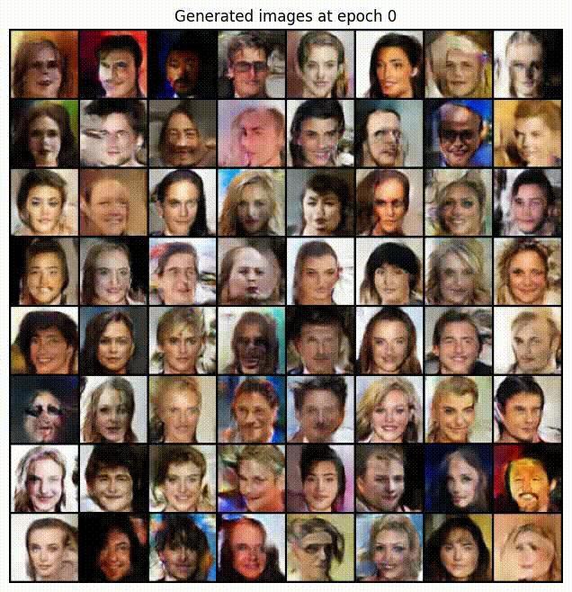

# DCGAN on CelebA

This project implements a **Deep Convolutional Generative Adversarial Network (DCGAN)** trained on the **CelebA** dataset to generate realistic human face images. The model is built in PyTorch and follows the architectural guidelines introduced in the original DCGAN paper.

The goal of this project is to explore stable GAN training and visualize how a generator progressively learns facial structure, identity, and texture over time.

---

## Results

The generator is evaluated using a fixed noise vector to visualize training progression across epochs. Below is a short video showing generated samples from early training to convergence.

- Epoch 0
- Epoch 5
- Epoch 10
- Epoch 15
- Final epoch

  

---

## Dataset

The model is trained on the **CelebA (Large-scale CelebFaces Attributes)** dataset, consisting of over 200,000 aligned celebrity face images.

**Preprocessing pipeline:**
- Center crop to 160×160
- Resize to 64×64
- Normalize to the range [-1, 1]

---

## Model Architecture

### Generator
- Input: 100-dimensional latent noise vector
- Stacked transposed convolutions
- Batch normalization and LeakyReLU activations
- Output: 64×64 RGB image
- Final activation: Tanh

### Discriminator
- Input: 64×64 RGB image
- Strided convolutions for downsampling
- Batch normalization and LeakyReLU activations
- Output: single logit (real vs fake)

The architecture closely follows the DCGAN design principles for stable training.

---

## Training Overview

- Optimizer: Adam (lr = 0.0002, betas = 0.5, 0.999)
- Loss: Binary cross-entropy with logits
- Batch size: 128
- Epochs: 20

Training alternates between discriminator and generator updates per batch, and intermediate samples are logged each epoch for visualization.

## References

- Radford, A., Metz, L., & Chintala, S.  
  *Unsupervised Representation Learning with Deep Convolutional Generative Adversarial Networks*

- CelebA Dataset  
  https://mmlab.ie.cuhk.edu.hk/projects/CelebA.html

